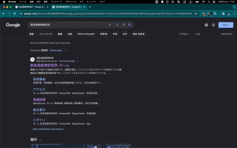

# eライブラリ links - student

## 概要

eライブラリのリンクをまとめた Chrome 拡張機能です。

## 導入方法

1. 以下の URL からフォルダをダウンロードしてください。

https://github.com/t-cool/e-library-links-student/archive/refs/heads/main.zip

2. 「拡張機能を管理」から、ディベロッパーモードを ON にしてください。

3. 「パッケージ化されていない拡張機能を読み込む」を選択し、フォルダを指定してください。

## ライセンス

GPL-3.0 License

